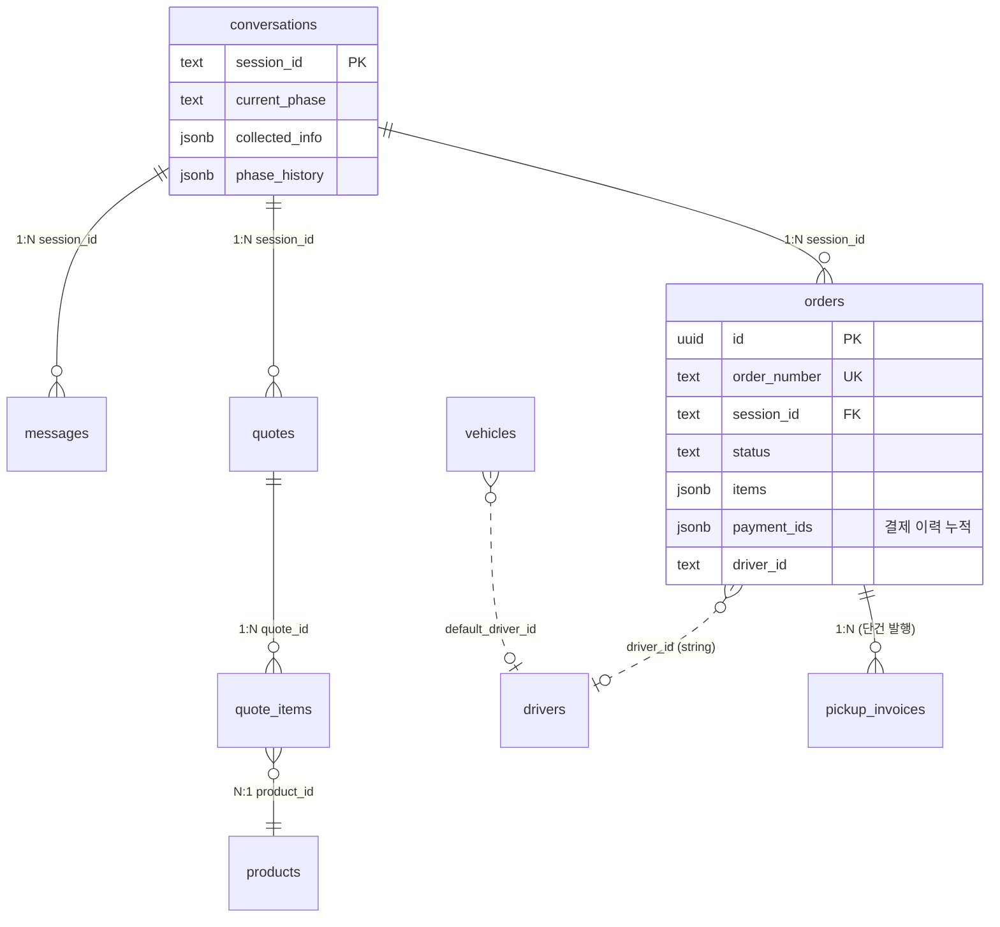
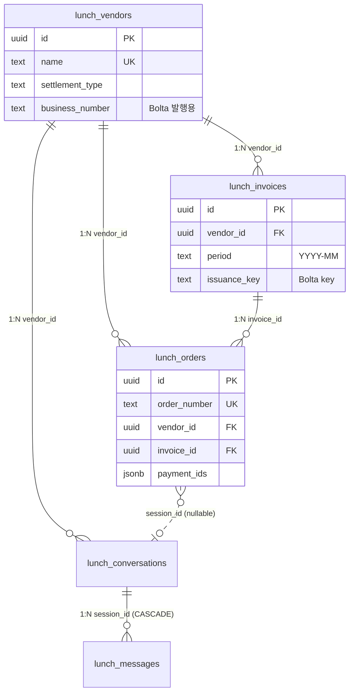
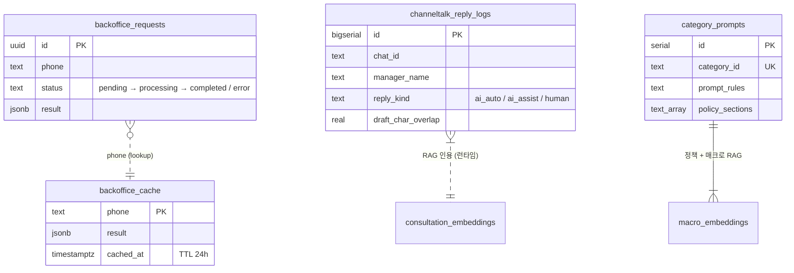
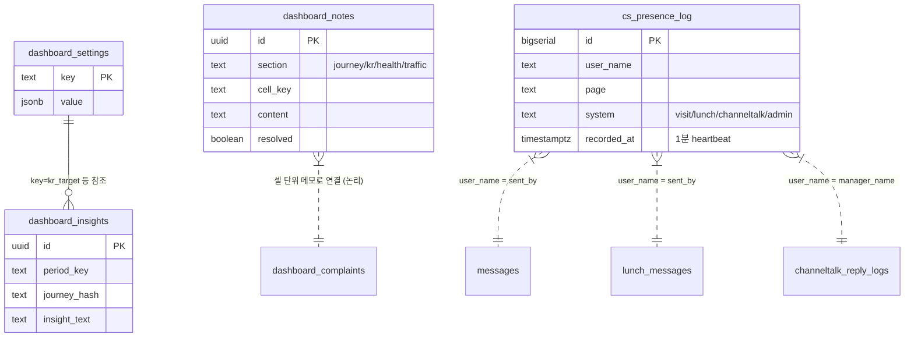
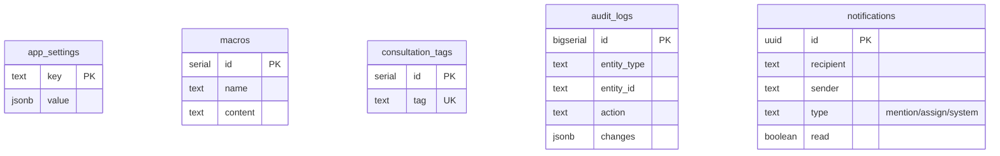

# ER 다이어그램

> 도메인별 핵심 테이블 관계. 정확한 컬럼은 각 도메인 문서 참조.

## 방문수거

`orders.memo` 에 `[커버링: <uuid>]` 패턴으로 외부 covering Supabase 의 `bookings` row 와 연결 (sendToCovering 의 단방향 동기화).

## 런치

## 채널톡

채널톡 메시지·세션 자체는 채널톡 플랫폼 소유.

## 대시보드

대시보드는 다른 도메인 테이블을 read 만 함 — 외래키는 명시적이지 않고 (user_name = sent_by 같은 join 키만 존재).

## 공유

`audit_logs` 가 orders / lunch_orders 의 CRUD 를 추적 (entity_type 으로 구분).
